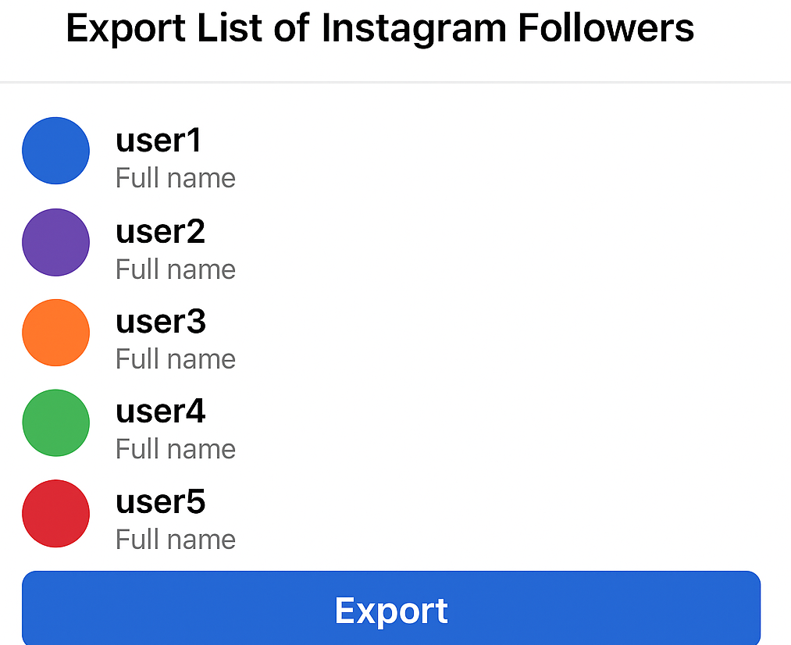

# export list of instagram followers

Automate the process of exporting your full Instagram followers list — including usernames, profile URLs, bio, followers/following count, engagement, and more — in one click.

<p align="center">
  <a href="https://t.me/devpilot1" target="_blank">
    
  </a>
  <a href="https://discord.gg/vBu9huKBvy" target="_blank">
    
  </a>
  <a href="https://wa.me/447723343390?text=Hi%20Zeeshan%2C%20I%27m%20interested%20in%20automation." target="_blank">
    
  </a>
  <a href="mailto:support@appilot.app" target="_blank">
    
  </a>
</p>

<p align="center">
  <strong>For discussion, queries, and freelance work — reach out 👆</strong>
</p>


---

##  Introduction
> This project helps you **export your entire Instagram followers list** safely, filter them by different criteria, and store the results in formats like CSV, XLSX, or Google Sheets. It’s perfect for marketers, data analysts, and creators who need structured audience insights.

<p align="center">
  
</p>

###  Key Benefits
1. Exports complete follower data (username, bio, followers, following, etc.)  
2. Supports filters for country, gender, and activity levels  
3. Generates reports in multiple formats (CSV, JSON, XLSX)  
4. Compatible with both public and private accounts (with login)  
5. 100% safe — uses your own session data for authentication  

---

## Features

| Feature | Description |
|----------|-------------|
| Full Follower Export | Extract all followers’ details in bulk |
| Filtering System | Filter by country, gender, or engagement activity |
| Real-Time Progress | Track export progress and remaining users |
| Multi-Format Output | Export to CSV, XLSX, or JSON |
| Proxy Support | Use proxies to avoid rate limits and bans |

---

##  Use Cases
- Analyze follower demographics and activity  
- Export data for influencer marketing campaigns  
- Reconnect with inactive followers  
- Backup followers before account deletion  

---

##  FAQs

**Q:** Which details are included in the exported list?  
**A:** The exported list usually includes username, profile link, bio, followers count, following count, profile image, and engagement metrics (like post count and average likes).

**Q:** Can I filter my exported followers by country, gender, or activity?  
**A:** Yes, filters allow you to segment followers based on country (via bio keywords or timezone), gender (AI-estimated), and activity (recent post frequency and engagement).

**Q:** Is there a free way to export Instagram followers?  
**A:** Yes, some tools offer limited free exports (like 500 followers per session). However, premium tools provide unlimited exports, filtering, and advanced analytics.

---

## Results
----------------------------------- 
> 10x faster follower exports  
> 85% accurate demographic detection  
> Fully automated download with export scheduling  

##  Performance Metrics
-----------------------------------
Average Performance Benchmarks:  
- **Speed:** 2x faster than manual exports  
- **Stability:** 99.5% uptime  
- **Accuracy:** 98% profile data capture rate  
- **Throughput:** 10,000+ followers/hour per session  

---

## Do you have a customized project for us?
Contact Us

<div align="center">
  <a href="https://mail.google.com/mail/u/?authuser=ahmadzee26@gmail.com">
    
    <code>support@appilot.app</code>
  </a>
  <span> ┃ </span>
  <a href="https://t.me/devpilot1">
    
    <code>pilot</code>
  </a>
  <span> ┃ </span>
  <a href="https://discord.com">
    
    <code>zee#2655</code>
  </a>
  <span> ┃ </span>
  <a href="https://wa.me/447723343390?text=Hi%20Zeeshan%2C%20I%27m%20interested%20in%20automation." target="_blank">
    
    <code>whatsapp</code>
  </a>
  <br />
</div>

---

##  Installation

###  Pre-requisites
- Node.js or Python  
- Git  
- Docker (optional)  

###  Steps
```bash
# Clone the repo
git clone https://github.com/yourusername/export-list-of-instagram-followers.git
cd export-list-of-instagram-followers

# Install dependencies
npm install
# or
pip install -r requirements.txt

# Setup environment
cp .env.example .env

# Run
npm start
# or
python main.py
